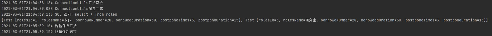

# 介绍
本项目为对于Dao层数据封装的一个实现。作为学习反射，JDBC，DAO的一个项目总结。

- 实现了数据库查询结果到实体类类型的映射转换。
- 实现了日志功能
- 实现了转换过程的字段映射功能
- 数据库链接的心跳检测与保活
- 数据获取链接前的检测
- 事务功能

# 截图

# Demo对应数据表结构
~~~sql
CREATE TABLE `roles` (
  `rolesId` int(11) NOT NULL COMMENT '角色ID',
  `rolesName` varchar(60) DEFAULT NULL COMMENT '角色名',
  `borrowedNumber` int(11) DEFAULT '20' COMMENT '借阅数量',
  `borowedduration` int(11) DEFAULT '30' COMMENT '借阅时长(天数)',
  `postponeTimes` int(11) DEFAULT '3' COMMENT '续借次数',
  `postponduration` int(11) NOT NULL DEFAULT '10' COMMENT '每次续借的天数'
) ENGINE=InnoDB DEFAULT CHARSET=utf8;

--
-- 转存表中的数据 `roles`
--

INSERT INTO `roles` (`rolesId`, `rolesName`, `borrowedNumber`, `borowedduration`, `postponeTimes`, `postponduration`) VALUES
(1, '本科', 20, 30, 3, 15),
(5, '研究生', 20, 30, 3, 15);

--
-- 转储表的索引
--

--
-- 表的索引 `roles`
--
ALTER TABLE `roles`
  ADD PRIMARY KEY (`rolesId`);

--
-- 在导出的表使用AUTO_INCREMENT
--

--
-- 使用表AUTO_INCREMENT `roles`
--
ALTER TABLE `roles`
  MODIFY `rolesId` int(11) NOT NULL AUTO_INCREMENT COMMENT '角色ID', AUTO_INCREMENT=6;
COMMIT;
~~~
# 思考
本项目实现是以查询结果为标准校验对象是否含有对应的属性。
最近考虑过后感觉以实体类作为标准去检验结果中是否存在对一个的字段或许会更加稳定，高效。（已实现）
 